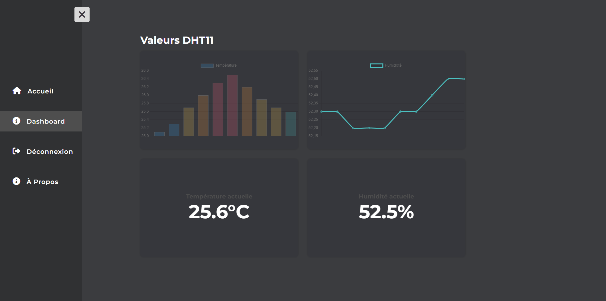

<div align="center">
  <h1>Projet IoT 2024</h1>

  <h3>Un projet sur la supervision d’une salle de serveurs</h3>

  <h4>
    <a href="#aperçu-du-projet">Aperçu du projet</a>
    •
    <a href="#captures-décran">Captures d'écran</a>
    •
    <a href="#participants">Participants</a>
  </h4>
</div>

<h2>Table des matières</h2>

- [Aperçu du projet](#aperçu-du-projet)
  - [Description du contexte](#description-du-contexte)
  - [Expression du besoin client](#expression-du-besoin-client)
- [Technologies utilisées](#technologies-utilisées)
- [Captures d'écran](#captures-décran)
- [Pour commencer](#pour-commencer)
  - [Exigences](#exigences)
  - [Installation](#installation)
  - [Configuration](#configuration)
- [Participants](#participants)

## Aperçu du projet

Ce projet a été réalisé dans le cadre de notre formation en BTS CIEL IR au lycée César Baggio. Il s'agit d'un système de surveillance environnementale pour une salle de serveurs, conçu pour répondre aux besoins de l'entreprise Nomios, dans le cadre d'une mise en situation.

### Description du contexte

Nomios est une entreprise informatique qui accompagne les clients dans l’étude, le choix et l’installation de solutions de sécurité. L’entreprise dispose d’une salle de serveurs qui abrite des équipements valorisés à plusieurs milliers d’euros. Maintenir l’équipement informatique à des températures et un taux d’humidité constants est un élément essentiel. Une température trop élevée engendre des pannes et une diminution de la durée de vie du matériel. Une humidité trop élevée engendre de la condensation.

### Expression du besoin client

Pour éviter les pannes et la condensation, il est important de pouvoir mesurer, stocker et visualiser les métriques environnementales de la salle de serveurs. De plus, l’administrateur doit être alerté en cas de température trop élevée.

## Technologies utilisées

- **HTML**
- **CSS**
- **JavaScript**
- **PHP**
- **MySQL**
- **bcrypt**
- **Chart.js**

## Captures d'écran

|                Tableau de bord                |
| :-------------------------------------------: |
|  |

## Pour commencer

### Exigences

- [WampServer](https://www.wampserver.com/) (ou une alternative pour le développement web)

### Installation

1. Cloner le dépôt dans le dossier root de votre serveur web (`www` pour WampServer) :
```
git clone https://github.com/alexwauquier/projet-iot-supervision-salle-serveurs.git
```

### Configuration

Vous pouvez changer les informations de connexion à la base de données dans le fichier `db.php` se trouvant dans le dossier `config`.

## Participants

- [BOUTABA Ianice](https://github.com/i4n1ce)
- [KONIECZKOWICZ Raphaël](https://github.com/fyles-git)
- [WAUQUIER Alex](https://github.com/alexwauquier)
